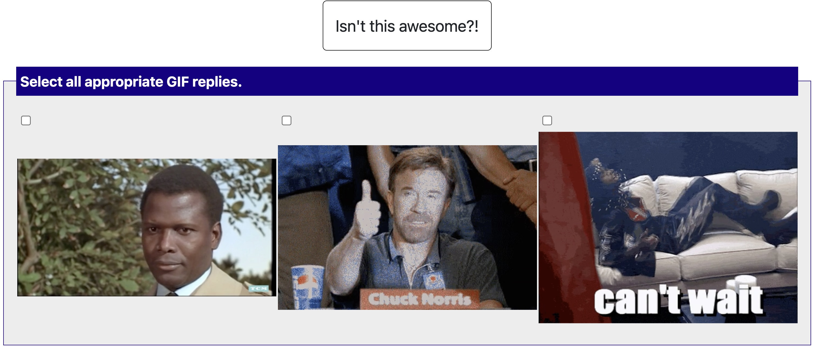
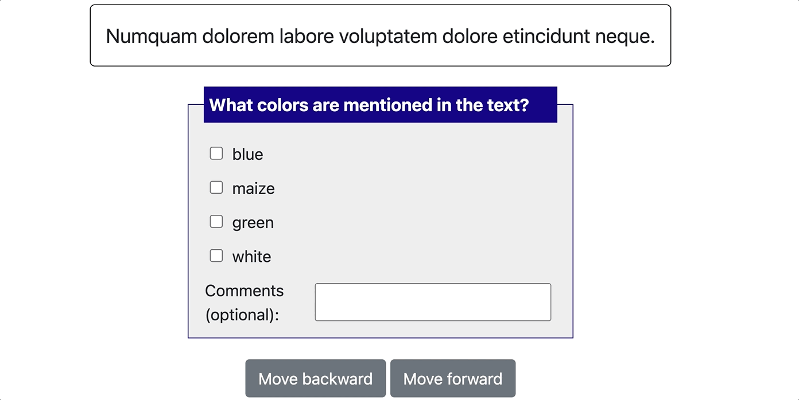
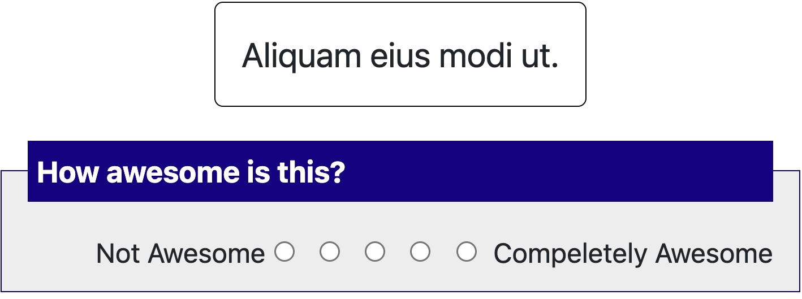
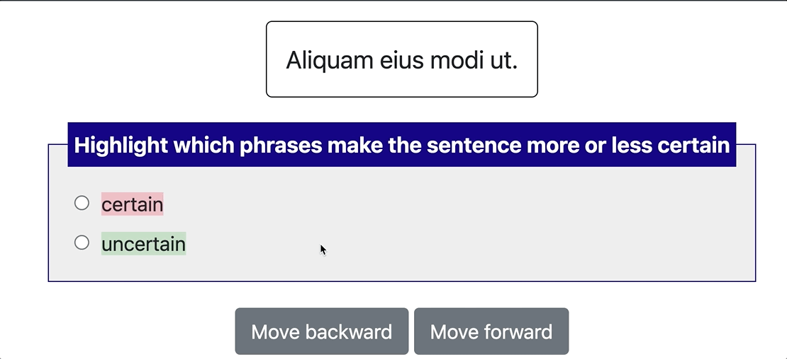
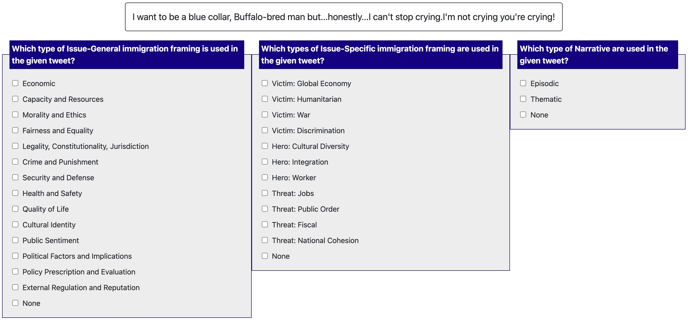

# Templates and Schemas

`potato` allows deployers to select one or more forms of annotation for
their data using predefined schema types in the `"annotation_schemes"`
field of the config yaml.

Deployers fill out which options should be shown and then each scheme is
rendered into HTML upon the completion of loading data. These schema
configurations allow deployers to quickly add keyboard shortcuts to
specific options or tooltips to help annotators.

## Existing Task templates

Templates for some existing tasks are available:

-   Question Answering: [yaml
    config](https://github.com/davidjurgens/potato/blob/b57d12a2bd2133604c00ebe80861c8187da4d6bf/config/examples/question-answering.yaml),
    [data
    example](https://github.com/davidjurgens/potato/blob/b57d12a2bd2133604c00ebe80861c8187da4d6bf/data/toy-example.json)
-   Sentiment Analysis: [yaml
    config](https://github.com/davidjurgens/potato/blob/b57d12a2bd2133604c00ebe80861c8187da4d6bf/config/examples/sentiment-analysis.yaml),
    [data
    example](https://github.com/davidjurgens/potato/blob/b57d12a2bd2133604c00ebe80861c8187da4d6bf/data/toy-example.json)
-   Animated GIF Appropriateness Annotation: [yaml
    config](https://github.com/davidjurgens/potato/blob/b57d12a2bd2133604c00ebe80861c8187da4d6bf/config/examples/simple-video-as-label.yaml),
    [data
    example](https://github.com/davidjurgens/potato/blob/b57d12a2bd2133604c00ebe80861c8187da4d6bf/data/video-label-example.json)
-   Single (Radio) Choice with Active Learning: [yaml
    config](https://github.com/davidjurgens/potato/blob/b57d12a2bd2133604c00ebe80861c8187da4d6bf/config/examples/simple-active-learning.yaml),
    [data
    example](https://github.com/davidjurgens/potato/blob/b57d12a2bd2133604c00ebe80861c8187da4d6bf/data/toy-example.json)

## Supported Schemas

`potato` currently support 4 customizable schemas with examples are
shown below.

## Multiple Choice

**Simple Checkbox Example** ([yaml
config](https://github.com/davidjurgens/potato/blob/b57d12a2bd2133604c00ebe80861c8187da4d6bf/config/examples/simple-check-box.yaml#L49),
[data
example](https://github.com/davidjurgens/potato/blob/b57d12a2bd2133604c00ebe80861c8187da4d6bf/data/toy-example.json)):


``` YAML
"annotation_schemes": [      
        {
            "annotation_type": "multiselect",
            "name": "favorite_color", 
            "description": "What colors are mentioned in the text?",
            "labels": [
               "blue", "maize", "green", "white"
            ],

            # If true, numbers [1-len(labels)] will be bound to each
            # label. Check box annotations with more than 10 are not supported
            # with this simple keybinding and will need to use the full item
            # specification to bind all labels to keys.
            "sequential_key_binding": True,            
        },       
]
```

**Video as label** We also support using video/animated-gif as label for
multi-modal annotation ([yaml
config](https://github.com/davidjurgens/potato/blob/b57d12a2bd2133604c00ebe80861c8187da4d6bf/config/examples/simple-video-as-label.yaml),
[data
example](https://github.com/davidjurgens/potato/blob/b57d12a2bd2133604c00ebe80861c8187da4d6bf/data/video-label-example.json)):



``` YAML
"annotation_schemes": [ 
      {
          "annotation_type": "multiselect",
          "name": "GIF Reply Appropriateness",
          "video_as_label": "True", # <- set this to True for video_as_label annotation
          "description": "Select all appropriate GIF replies.",

          # Files http://[server]:[port]/data/* will be forwarded from directory data/files/*
          "labels": [
             {"name": "{{instance_obj.gifs[0]}}", "videopath": "/files/{{instance_obj.gifs_path[0]}}"},
             {"name": "{{instance_obj.gifs[1]}}", "videopath": "/files/{{instance_obj.gifs_path[1]}}"},
             {"name": "{{instance_obj.gifs[2]}}", "videopath": "/files/{{instance_obj.gifs_path[2]}}"},
          ],

          # If true, numbers [1-len(labels)] will be bound to each
          # label. Check box annotations with more than 10 are not supported
          # with this simple keybinding and will need to use the full item
          # specification to bind all labels to keys.
          "sequential_key_binding": True,            
      },       
  ],
```

**Multiple Choice with Free Response** ([yaml
config](https://github.com/davidjurgens/potato/blob/b57d12a2bd2133604c00ebe80861c8187da4d6bf/config/examples/simple-check-box-with-free-response.yaml),
[data
example](https://github.com/davidjurgens/potato/blob/b57d12a2bd2133604c00ebe80861c8187da4d6bf/data/toy-example.csv)):



``` YAML
"annotation_schemes": [      
      {
          "annotation_type": "multiselect",
          "name": "favorite_color", 
          "description": "What colors are mentioned in the text?",
          "labels": [
             "blue", "maize", "green", "white"
          ],

          # If true, the field will have an optional text box the user can 
          'has_free_response': True,

          # If true, numbers [1-len(labels)] will be bound to each
          # label. Check box annotations with more than 10 are not supported
          # with this simple keybinding and will need to use the full item
          # specification to bind all labels to keys.
          "sequential_key_binding": True,            
      },       
  ],
```

## Single Choice (Radio)

**Simple Single (radio) Choice Example** ([yaml
config](https://github.com/davidjurgens/potato/blob/b57d12a2bd2133604c00ebe80861c8187da4d6bf/config/examples/simple-single-choice-selection.yaml#L49),
[data
example](https://github.com/davidjurgens/potato/blob/b57d12a2bd2133604c00ebe80861c8187da4d6bf/data/toy-example.json)):

``` YAML
"annotation_schemes": [      
      {
          "annotation_type": "radio",
          "name": "favorite_color", 
          "description": "What food does this text make you want to eat?",
          "labels": [
             "pizza", "bagels", "burgers", "curry", "tacos",
          ],
          # If true, numbers [1-len(labels)] will be bound to each
          # label. Check box annotations with more than 10 are not supported
          # with this simple keybinding and will need to use the full item
          # specification to bind all labels to keys.
          "sequential_key_binding": True,                        
      },       
  ]
```

**Best-Worst Scaling Example** ([yaml
config](https://github.com/davidjurgens/potato/blob/b57d12a2bd2133604c00ebe80861c8187da4d6bf/config/examples/simple-best-worst-scaling.yaml#L53),
[data
example](https://github.com/davidjurgens/potato/blob/b57d12a2bd2133604c00ebe80861c8187da4d6bf/data/bws-example.json)):


``` YAML
"annotation_schemes": [      
      {
          "annotation_type": "radio",
          "name": "bws_best",
          "description": "Which is the most positive sentence?",

          # If true, display the labels horizontally
          "horizontal": True,

          "labels": [
             "A", "B", "C", "D", "E",
          ],
          "sequential_key_binding": True,                        
      },

      {
        "annotation_type": "radio",
        "name": "bws_worst",
        "description": "Which is the most negative sentence?",

        # If true, display the labels horizontally
        "horizontal": True,

        "labels": [
          "A", "B", "C", "D", "E",
        ],
        "sequential_key_binding": True,
      },
  ]
```

## Likert

**Simple Likert Example** ([yaml
config](https://github.com/davidjurgens/potato/blob/b57d12a2bd2133604c00ebe80861c8187da4d6bf/config/examples/simple-likert.yaml#L39),
[data
example](https://github.com/davidjurgens/potato/blob/b57d12a2bd2133604c00ebe80861c8187da4d6bf/data/toy-example.json)):



``` YAML
"annotation_schemes": [      
      {
          "annotation_type": "likert",

          # This name gets used in reporting the annotation results
          "name": "awesomeness",

          # This text is shown to the user and can be a longer statement
          "description": "How awesome is this?",

          # The min and max labels are text shown at each end of the scale
          "min_label": "Not Awesome",
          "max_label": "Compeletely Awesome",

          # How many scale points to show
          "size": 5,

          # If true, keys [1-size] will be bound to scale responses. Likert
          # scales larger than 10 are not supported with this simple
          # keybinding and will need to use the full item specification to
          # bind all scale points to keys.
          "sequential_key_binding": True,
      }       
  ]
```

## Text span

**Simple Text Span Example** ([yaml
config](https://github.com/davidjurgens/potato/edit/master/config/examples/simple-span-labeling.yaml#L47),
[data
example](https://github.com/davidjurgens/potato/blob/b57d12a2bd2133604c00ebe80861c8187da4d6bf/data/toy-example.json)):



``` YAML
"annotation_schemes": [      
    {
        "annotation_type": "highlight",
        "name": "certainty", 
        "description": "Highlight which phrases make the sentence more or less certain",
        "labels": [
           "certain", "uncertain"
        ],

        # If true, numbers [1-len(labels)] will be bound to each
        # label. Highlight selection annotations with more than 10 are not supported
        # with this simple keybinding and will need to use the full item
        # specification to bind all labels to keys.
        "sequential_key_binding": True,            
    },       
], 
```

## Text Box

**Simple Text Box Example** ([yaml
config](https://github.com/davidjurgens/potato/blob/b57d12a2bd2133604c00ebe80861c8187da4d6bf/config/examples/simple-text-box.yaml#L53),
[data
example](https://github.com/davidjurgens/potato/blob/b57d12a2bd2133604c00ebe80861c8187da4d6bf/data/toy-example.json)):


``` YAML
"annotation_schemes": [      
    {
        "annotation_type": "text",
        "name": "textbox_input",
        "description": "How does this text make you feel?",
    }       
]
```

If you wants to use a textarea, simply add a text area field in the annotation_schemas and you can also add multiple input textboxes 
with "labels":
``` YAML
"annotation_schemes": [      
    {
        "annotation_type": "text",
        "name": "textbox_input",
        "description": "How does this text make you feel?",
        # you could easily define a list of textboxes within one schema with a list of labels
        "labels": ['happy?','sad?'],
        # if you want to use multi-line textbox, turn on the text area and set the desired rows and cols of the textbox
            "textarea": {
              "on": False,
              "rows": 2,
              "cols": 40
        }
    }       
]
```

## Pairwise comparison

**Simple Pairwise Example** ([yaml
config](https://github.com/davidjurgens/potato/blob/master/config/examples/simple-pairwise-comparison.yaml#L34),
[data
example](https://github.com/davidjurgens/potato/blob/b57d12a2bd2133604c00ebe80861c8187da4d6bf/data/pairwise-example.json)):


``` YAML
#setting up list_as_text input, where the pairs will be inputed as a list of texts and potato will automatically unfold them 
"list_as_text": {
  "text_list_prefix_type": 'alphabet'
},

"annotation_schemes": [      
    {
        "annotation_type": "text",
        "name": "textbox_input",
        "description": "How does this text make you feel?",
    }       
]
```

## Tasks with multiple schemas

`potato` also support using multiple (different) schemas per annotation task as shown
below:



``` YAML
"annotation_schemes": [
      {
          "annotation_type": "multiselect",
          "single_select":"True",
          "name": "Issue-General",
          "labels": [
              { 
                "name": "Economic",
                "tooltip_file": "config/tooltips/ig_economic.html",
                "key_value": '1'
              },
              # ...
          ]
      },
      {
          "annotation_type": "multiselect",
          "name": "Issue-Specific",
          "labels": [

              { 
                "name": "Victim: Global Economy",
                "tooltip_file": "config/tooltips/sp_global.html"
              },
              # ...
          ]

      },
      # ... more schemes
  ],
```

## Add the codebook to the page

If you have a url to a codebook (e.g., in Google Docs), you can add it
to the page by setting the `annotation_codebook_url` field in the YAML
file. You can also add the task name as the page title using the
`annotation_task_name` field.

``` yaml
# page title
"annotation_task_name": "Example Task",

# If annotators are using a codebook, this will be linked at the top to the
# instance for easy access
"annotation_codebook_url": "https://www.codebook.com",
```

## Choose (or create) your HTML template

Set up the annotation interface by picking an existing HTML template
([examples](https://github.com/davidjurgens/potato/tree/master/templates/examples))
or creating a custom template:

-   `templates/examples/plain_layout.html`: this template covers a wide
    range of NLP tasks (e.g., text classification, image or gif
    classification, Likert scales, best-worst scaling, question
    answering, multiple questions), and is designed to minimize
    scrolling and optimize placement of the document and questions on
    the screen.
-   `templates/quotes.html`: this template specifies the layout when you
    want to annotate, not a standalone document, but a document in
    context of some other document (e.g., if you\'re annotating replies
    to a post, and want to show the original post)
-   `templates/examples/kwargs_example.html`: this template specifies
    the layout for a task where each document is rated on some Likert
    scales with differing endpoints (`kwargs` and `other_kwargs`). It\'s
    an example of how to use a custom keyword argument in an HTML file.
-   Custom: Create an HTML file that lays out your task pieces and
    upload it to `potato/templates/`. The templates can be easily
    customized using JINJA expressions to specify where parts of the
    annotation task and data are populated within the user-defined
    template. ([custom example
    1](https://github.com/davidjurgens/potato/tree/master/templates/examples/kwargs_example.html),
    [custom example
    2](https://github.com/davidjurgens/potato/tree/master/templates/quotes.html))

## Update YAML file with look and feel

In the YAML file, you\'ll need to specify what the annotation interface
looks like. The `html_layout` field can be updated per the prior
section. The rest of the fields can generally be left untouched.

``` yaml
# The html that changes the visualiztation for your task. Change this file
# to influence the layout and description of your task. This is not a full
# HTML page, just the piece that does lays out your task's pieces
"html_layout": "templates/examples/plain_layout.html",

# The core UI files for Potato. You should not need to change these normally.
#
# Exceptions to this might include:
# 1) You want to add custom CSS/fonts to style your task
# 2) Your layout requires additional JS/assets to render
# 3) You want to support additional keybinding magic
#
"base_html_template": "templates/base_template.html",
"header_file": "templates/header.html",

# This is where the actual HTML files will be generated. You should not need to change this normally.
"site_dir": "potato/templates/",
```
